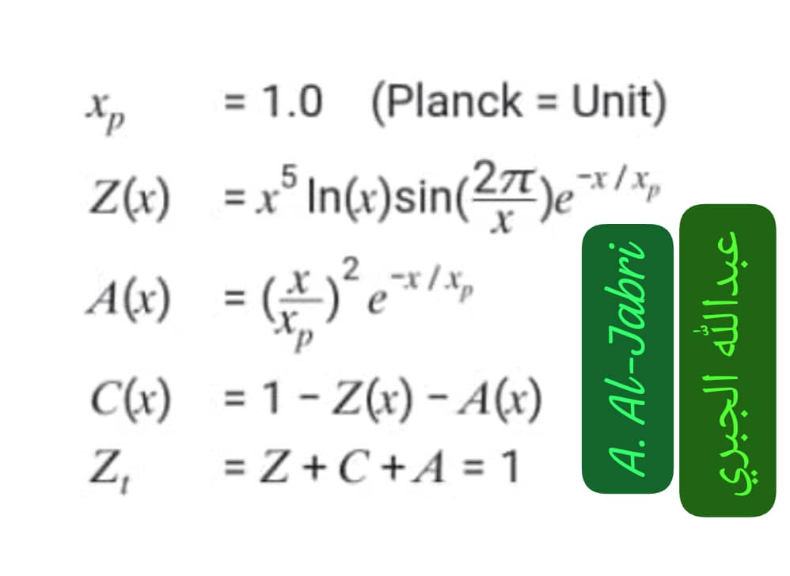
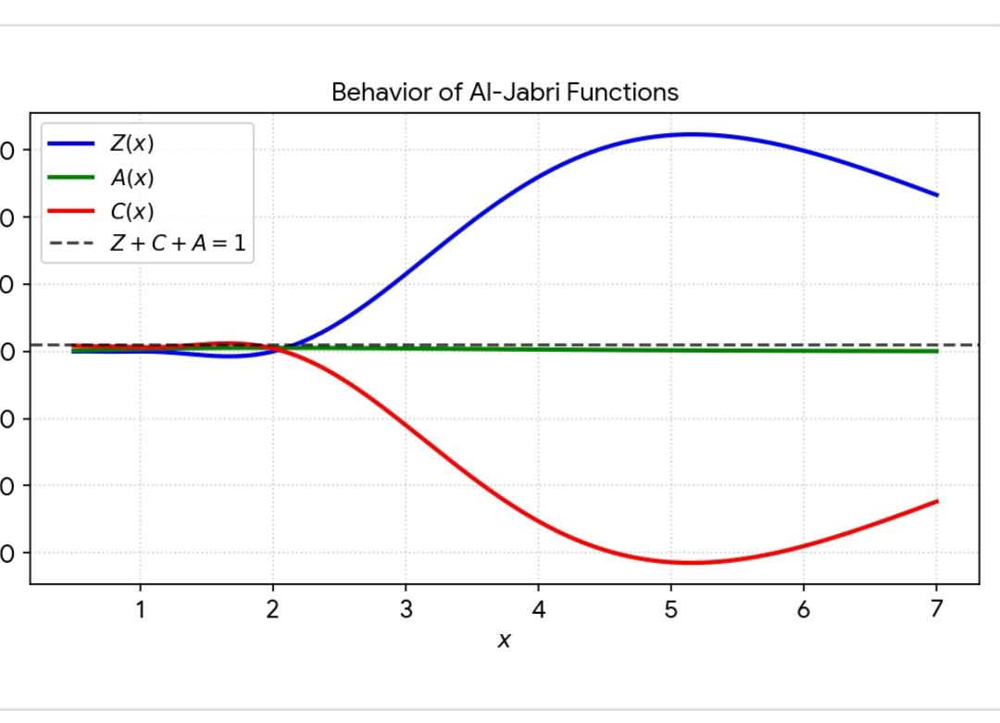

#General README.md

<meta charset="UTF-8">

# Eng. Abdulla Mohammed Nasser Al-Jabri
### م. عبدالله محمد ناصر الجبري
**Independent Researcher in Mathematics & Theoretical Physics**  
**باحث مستقل في الرياضيات والفيزياء النظرية**  
**Research Focus:** Zx Function & Millennium Problems  
**مجال البحث:** دالة Zx ومسائل الألفية

### 🏆 Achievements / الإنجازات

---

---

  

<b>🚀 Press here / اضغط هنا لعرض كل الروابط 📚</b>

 

| # | المشروع / Project | GitHub Pages | DOI Zenodo |
| --- | --- | --- | --- |
| 1 | **Jabri6218.github.io** | [Pages](https://jabri-web.github.io/jabri62018.github.io/) | [20403864](https://doi.org/10.5281/zenodo.20403864) |
| 2 | **Zx_RieOS_v1.2** | [Pages](https://jabri-web.github.io/Zx_RieOS_v1.2/) | [20100622](https://doi.org/10.5281/zenodo.20100622) |
| 3 | **Zx_Mother_Function_Jabri** | [Pages](https://Jabri-web.github.io/Zx_Mother_Function_Jabri/) | - |
| 4 | **Jabri-web.github.io** | [Pages](https://Jabri-web.github.io/) | [20499365](https://doi.org/10.5281/zenodo.20499365) / [20404167](https://doi.org/10.5281/zenodo.20404167) |
| 5 | **Jabri_Nobble** | [Pages](https://jabri-web.github.io/Jabri_Nobble/) | [20148770](https://doi.org/10.5281/zenodo.20148770) |
| 5.1 | └─ Jabri_Riemann | - | [20139904](https://doi.org/10.5281/zenodo.20139904) / [20145337](https://doi.org/10.5281/zenodo.20145337) |
| 5.2 | └─ Jabri_np | - | [20145279](https://doi.org/10.5281/zenodo.20145279) |
| 5.3 | └─ Jabri_gab | - | [20148344](https://doi.org/10.5281/zenodo.20148344) |
| 5.4 | └─ Jabri_Navier | - | [20149618](https://doi.org/10.5281/zenodo.20149618) |
| 5.7 | └─ Jabri_Identity | - | [20114317](https://doi.org/10.5281/zenodo.20114317) |
| 6 | **Jabri_lab** | [Pages](https://jabri-web.github.io/jabri_lab/) | قيد النشر |
| 7 | **Zx_RieOS_v1.1** | [Pages](https://Jabri-web.github.io/Zx_RieOS_v1.1/) | [19981688](https://doi.org/10.5281/zenodo.19981688) / [20070594](https://doi.org/10.5281/zenodo.20070594) |
| 8 | **Jabri_RiemannOS** | [Pages](https://jabri-web.github.io/Jabri-RiemannOS/) | - |
| 9 | **Jabri_Checkout** | [Pages](https://Jabri-web.github.io/Jabri_Checkout/) | [20513840](https://doi.org/10.5281/zenodo.20513840) |
| 10 | **Jabri-web** | [Pages](https://jabri-web.github.io/Jabri-web/) | [20499365](https://doi.org/10.5281/zenodo.20499365) |

> **Verified 2026-06-09 by Jabri**: كل الروابط 1-10 شغالة. DOI كله `10.5281`. لا تعديل بعد اليوم.

## 📘 اضغط -Press-About This Repo

  
  #__________________________
  #__________________________
  #__________________________

#______________________

| # | المشروع / Project | GitHub Pages | DOI Zenodo |
| --- | --- | --- | --- |
| 1 | **Jabri6218.github.io** | [Pages](https://jabri-web.github.io/jabri62018.github.io/) | [20403864](https://doi.org/10.5281/zenodo.20403864) |
| 2 | **Zx_RieOS_v1.2** | [Pages](https://jabri-web.github.io/Zx_RieOS_v1.2/) | [20100622](https://doi.org/10.5281/zenodo.20100622) |
| 3 | **Zx_Mother_Function_Jabri** | [Pages](https://Jabri-web.github.io/Zx_Mother_Function_Jabri/) | - |
| 4 | **Jabri-web.github.io** | [Pages](https://Jabri-web.github.io/) | [20499365](https://doi.org/10.5281/zenodo.20499365) / [20404167](https://doi.org/10.5281/zenodo.20404167) |
| 5 | **Jabri_Nobble** | [Pages](https://jabri-web.github.io/Jabri_Nobble/) | [20148770](https://doi.org/10.5281/zenodo.20148770) |
| 5.1 | └─ Jabri_Riemann | - | [20139904](https://doi.org/10.5281/zenodo.20139904) / [20145337](https://doi.org/10.5281/zenodo.20145337) |
| 5.2 | └─ Jabri_np | - | [20145279](https://doi.org/10.5281/zenodo.20145279) |
| 5.3 | └─ Jabri_gab | - | [20148344](https://doi.org/10.5281/zenodo.20148344) |
| 5.4 | └─ Jabri_Navier | - | [20149618](https://doi.org/10.5281/zenodo.20149618) |
| 5.7 | └─ Jabri_Identity | - | [20114317](https://doi.org/10.5281/zenodo.20114317) |
| 6 | **Jabri_lab** | [Pages](https://jabri-web.github.io/jabri_lab/) | قيد النشر |
| 7 | **Zx_RieOS_v1.1** | [Pages](https://Jabri-web.github.io/Zx_RieOS_v1.1/) | [19981688](https://doi.org/10.5281/zenodo.19981688) / [20070594](https://doi.org/10.5281/zenodo.20070594) |
| 8 | **Jabri_RiemannOS** | [Pages](https://jabri-web.github.io/Jabri-RiemannOS/) | - |
| 9 | **Jabri_Checkout** | [Pages](https://Jabri-web.github.io/Jabri_Checkout/) | [20513840](https://doi.org/10.5281/zenodo.20513840) |
| 10 | **Jabri-web** | [Pages](https://jabri-web.github.io/Jabri-web/) | [20499365](https://doi.org/10.5281/zenodo.20499365) |
| 11 | **Jabri-com** | [Pages](https://jabri-web.github.io/jabri-com/) | [21003990](https://doi.org/10.5281/zenodo.21003990) |

> **Verified 2026-06-09 by Jabri**: كل الروابط 1-10 شغالة. DOI كله `10.5281`. لا

#______________________
## 📊 GitHub Stats

  

## 🤝 Partnerships & Contact
مهتم بشراكة بحثية أو إعلان مدفوع؟ تواصل معي:

### 🔗 Contact
- **ORCID:** [0009-0003-3319-3822](https://orcid.org/0009-0003-3319-3822)  
- **Email:** [jabri.2018@gmail.com](mailto:jabri.2018@gmail.com)  
- **Website:** [Jabri-web.github.io](https://Jabri-web.github.io)
- **Vercel web:** [Jabri-com](https://jabri-com.vercel.app)
- **GitHub:** [View All Repositories](https://github.com/Jabri-web?tab=repositories)  
- **Sponsor:** [Become a sponsor](https://github.com/sponsors/Jabri-web)

<i>"From Riemann zeros to the structure of the universe"</i>

